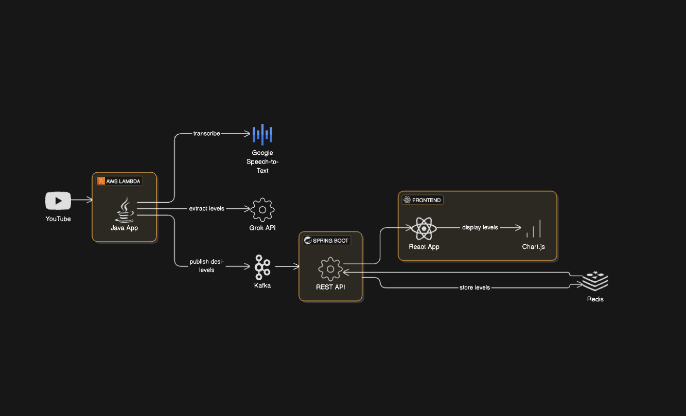

# MarketEdge

**MarketEdge** is a real-time trading dashboard that streams live prices for stocks, options, and futures (e.g., ES, NQ, NVDA) and overlays expert support/resistance levels extracted from a daily YouTube video. Built with Java, Kafka, and React, it lets users select symbols, view charts, and trade with an edge.



## Features
- **Real-Time Data**: Streams live prices via IBKR API and Kafka.
- **Expert Levels**: Automatically pulls support/resistance levels (e.g., ES 5650-5690) from a daily YouTube video.
- **Customizable Dashboard**: Select symbols (e.g., ES, NQ, NVDA, SPY) to display on a Chart.js candlestick chart with S/R lines.
- **Scalable**: Hosted on AWS ECS Fargate, with Redis for caching.

## Tech Stack
- **Backend**: Java 23, Spring Boot, Kafka, Redis
- **Frontend**: React, Chart.js
- **APIs**: YouTube Data API, Google Speech-to-Text, xAI (Grok) or OpenAI
- **Infra**: AWS (Lambda, ECS Fargate, SES), Docker

## Prerequisites
- Java 23
- Gradle
- Docker
- AWS account (ECS Fargate, Lambda, SES)
- Kafka (local or Confluent Cloud)
- Redis
- API Keys:
  - YouTube Data API (Google Cloud Console)
  - Google Speech-to-Text
  - xAI (Grok) or OpenAI (for summarization)
  - IBKR API (for live data)

## Setup Instructions

### 1. Clone the Repository
```bash
git clone https://github.com/yourusername/marketedge.git
cd marketedge

### 2. Configure Environment Variables
Create a .env file in the project root:

```bash
YOUTUBE_API_KEY=your-youtube-api-key
GOOGLE_SPEECH_API_KEY=your-speech-api-key
XAI_API_KEY=your-xai-api-key # or OPENAI_API_KEY
KAFKA_BOOTSTRAP_SERVERS=localhost:9092
REDIS_HOST=localhost
REDIS_PORT=6379
AWS_ACCESS_KEY=your-aws-access-key
AWS_SECRET_KEY=your-aws-secret-key
AWS_REGION=us-east-1
IBKR_HOST=localhost
IBKR_PORT=7497
